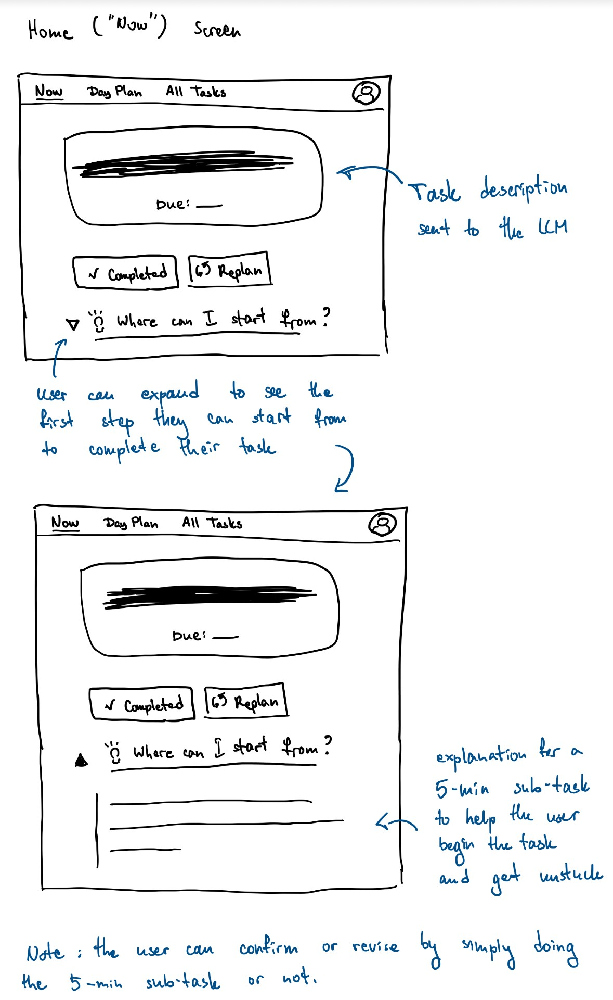

# Assignment 3: Focus

I have chosen to augment the Focus concept. This concept is the most direct interface for the user's current work, making it the perfect place to introduce an AI feature that helps them overcome the initial friction of starting that very task. The "First Step" generator fits naturally here as a way to enhance the core purpose of the Focus concept, which is to eliminate decision fatigue.

## Concept: Focus

**Original Concept**

```
concept Focus [User, Task]
  purpose to eliminate decision fatigue by presenting the single task a user should be working on right now
  principle it presents the currently scheduled task to the user, providing a single point of focus
  state
    a CurrentTask element of User with
      a task Task
  actions
    setCurrentTask (user: User, task: Task)
      effect sets the specified task as the user's current focus
    clearCurrentTask (user: User)
      effect removes the current task for the user
    getCurrentTask (user: User): (task: optional Task)
      effect returns the user's current task, if any
```


**AI-Augmented Concept**

```
concept Focus [User, Task]
  purpose to present a single task for the user to work on, with an AI-generated first step available on demand
  principle the user is shown one current task; they can trigger an AI action to generate a single, small starting step for that task.

  state
    a CurrentTask element of User with
      a task Task
      
    an optional FirstStepSuggestion element of User with
      a forTask Task
      a suggestionText String

  actions
    setCurrentTask (user: User, task: Task)
      effect sets the specified task as the user's current task and clears any FirstStepSuggestion
      
    clearCurrentTask (user: User)
      effect removes the current task and any FirstStepSuggestion
      
    getCurrentTask (user: User): (task: optional Task)
      effect returns the user's current task, if any
    
    generateFirstStep (user: User, task: Task)
      requires current task is set and matches the provided task
      effect calls an LLM to generate a five-min starting action and creates a FirstStepSuggestion
```

## User Interaction



**User Journey**

Alex opens the "Now" screen in her app and sees her most daunting task: "Write research paper." She feels stuck, facing the classic paralysis of not knowing where to start. Her eyes land on the expand icon next to "💡 Where can I start from?". Curious and needing a nudge, she taps it. The section smoothly expands, revealing a single, concrete suggestion from the AI: "Open a new document and write down five potential titles." The suggestion is small, clear, and not intimidating. The mental block shatters. Alex feels a sense of relief and immediately opens a document to begin. She has successfully overcome the initial inertia and started her work.

## Prerequisites

- **Node.js** (version 14 or higher)
- **TypeScript** (will be installed automatically)
- **Google Gemini API Key** (free at [Google AI Studio](https://makersuite.google.com/app/apikey))

## Quick Setup

### 0. Clone the repo locally and navigate to it
```cd intro-gemini-schedule```

### 1. Install Dependencies

```bash
npm install
```

### 2. Add Your API Key

**Why use a template?** The `config.json` file contains your private API key and should never be committed to version control. The template approach lets you:
- Keep the template file in git (safe to share)
- Create your own `config.json` locally (keeps your API key private)
- Easily set up the project on any machine

**Step 1:** Copy the template file:
```bash
cp config.json.template config.json
```

**Step 2:** Edit `config.json` and add your API key:
```json
{
  "apiKey": "YOUR_GEMINI_API_KEY_HERE"
}
```

**To get your API key:**
1. Go to [Google AI Studio](https://makersuite.google.com/app/apikey)
2. Sign in with your Google account
3. Click "Create API Key"
4. Copy the key and paste it into `config.json` (replacing `YOUR_GEMINI_API_KEY_HERE`)

### 3. Run the Application

**Run all test cases:**
```bash
npm start
```

**Run specific test cases:**
```bash
npm run manual    # Manual scheduling only
npm run llm       # LLM-assisted scheduling only
npm run mixed     # Mixed manual + LLM scheduling
```

## File Structure

```
dayplanner/
├── package.json              # Dependencies and scripts
├── tsconfig.json             # TypeScript configuration
├── config.json               # Your Gemini API key
├── dayplanner-types.ts       # Core type definitions
├── dayplanner.ts             # DayPlanner class implementation
├── dayplanner-llm.ts         # LLM integration
├── dayplanner-tests.ts       # Test cases and examples
├── dist/                     # Compiled JavaScript output
└── README.md                 # This file
```

## Test Cases

The application includes three comprehensive test cases:

### 1. Manual Scheduling
Demonstrates adding activities and manually assigning them to time slots:

```typescript
const planner = new DayPlanner();
const breakfast = planner.addActivity('Breakfast', 1); // 30 minutes
planner.assignActivity(breakfast, 14); // 7:00 AM
```

### 2. LLM-Assisted Scheduling
Shows AI-powered scheduling with hardwired preferences:

```typescript
const planner = new DayPlanner();
planner.addActivity('Morning Jog', 2);
planner.addActivity('Math Homework', 4);
await llm.requestAssignmentsFromLLM(planner);
```

### 3. Mixed Scheduling
Combines manual assignments with AI assistance for remaining activities.

## Sample Output

```
📅 Daily Schedule
==================
7:00 AM - Breakfast (30 min)
8:00 AM - Morning Workout (1 hours)
10:00 AM - Study Session (1.5 hours)
1:00 PM - Lunch (30 min)
3:00 PM - Team Meeting (1 hours)
7:00 PM - Dinner (30 min)
9:00 PM - Evening Reading (1 hours)

📋 Unassigned Activities
========================
All activities are assigned!
```

## Key Features

- **Simple State Management**: Activities and assignments stored in memory
- **Flexible Time System**: Half-hour slots from midnight (0-47)
- **Query-Based Display**: Schedule generated on-demand, not stored sorted
- **AI Integration**: Hardwired preferences in LLM prompt (no external hints)
- **Conflict Detection**: Prevents overlapping activities
- **Clean Architecture**: First principles implementation with no legacy code

## LLM Preferences (Hardwired)

The AI uses these built-in preferences:
- Exercise activities: Morning (6:00 AM - 10:00 AM)
- Study/Classes: Focused hours (9:00 AM - 5:00 PM)
- Meals: Regular intervals (breakfast 7-9 AM, lunch 12-1 PM, dinner 6-8 PM)
- Social/Relaxation: Evenings (6:00 PM - 10:00 PM)
- Avoid: Demanding activities after 10:00 PM

## Troubleshooting

### "Could not load config.json"
- Ensure `config.json` exists with your API key
- Check JSON format is correct

### "Error calling Gemini API"
- Verify API key is correct
- Check internet connection
- Ensure API access is enabled in Google AI Studio

### Build Issues
- Use `npm run build` to compile TypeScript
- Check that all dependencies are installed with `npm install`

## Next Steps

Try extending the DayPlanner:
- Add weekly scheduling
- Implement activity categories
- Add location information
- Create a web interface
- Add conflict resolution strategies
- Implement recurring activities

## Resources

- [Google Generative AI Documentation](https://ai.google.dev/docs)
- [TypeScript Documentation](https://www.typescriptlang.org/docs/)
